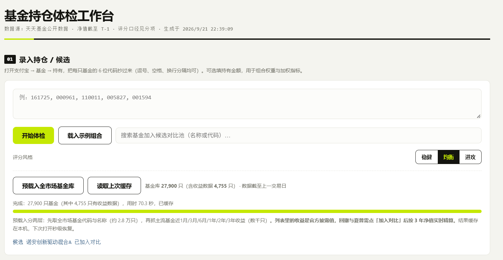
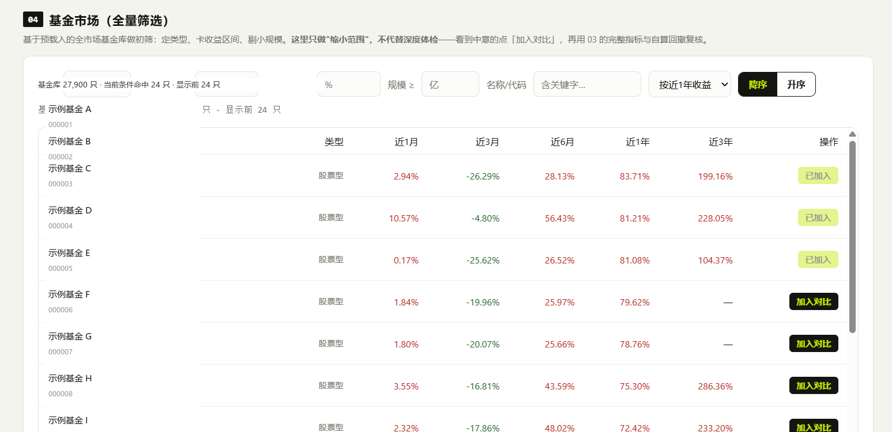
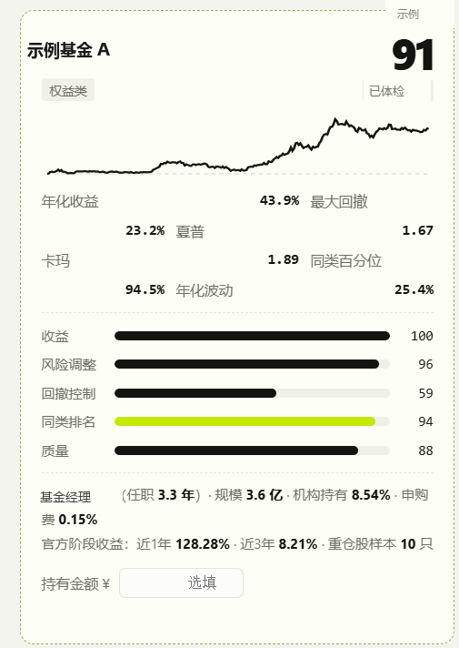
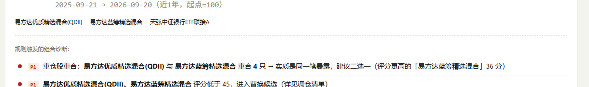

# 基金持仓体检工作台

一个单文件的基金数据整理工具。输入 6 位基金代码，把净值、收益、回撤、夏普比率按统一口径算出来，摊在一张表上看。

**在线版：<https://fredombobo.github.io/fund-portfolio-checker/>**

**它不预测涨跌，也不告诉你该买哪只。** 它只做一件事：把公开数据整理成可复核的形式，让你看清自己实际承担了多少风险。

> ⚠️ 本项目为个人自用的数据整理工具，**不构成投资建议**。历史业绩不预示未来收益，投资有风险。

---

## 这是什么

一个 `.html` 文件。双击打开就能用，不需要服务器、不需要安装环境、不需要注册账号。

| 项目 | 实际情况 |
|---|---|
| 外部依赖 | 0 个 CDN |
| 样式与脚本 | 全部内联 |
| 文件体积 | 约 60 KB |
| 联网用途 | 仅抓取公开净值数据 |
| 断网时 | 界面全开，数据读本地缓存 |

界面本身完全离线可用。净值、收益、回撤这些数字是实时抓公开数据的，所以断网时只能看上次缓存的快照。净值本身截至上一个交易日，不是实时价。

---

## 功能

### 01 基金数据整理
输入基金代码，输出一张数据卡：年化收益、年化波动率、最大回撤、夏普比率、卡玛比率、同类百分位、基金经理任职年限、机构持有占比、重仓股样本。每个指标都标注了计算口径。

### 02 持仓组合视图
填写各只基金的持有金额，计算组合层面的加权收益与加权回撤，并按前十大重仓股做重合度检测。多只基金重仓同一批股票时会给出提示——这种情况下的"分散"实际上是重复暴露。

### 03 全市场筛选
预载全市场基金代码与名称（实测 27,900 只，约 70 秒），支持按类型、收益区间、规模筛选。列表中的收益为官方披露值；回撤与夏普需要点「加入对比」后按近 3 年净值实时计算。

### 04 数据汇总表
把多只基金的指标按列并排，便于横向对照。所有数值均为可验证的客观计算，不含主观评级或倾向性结论。

---

## 数据来源

全部来自天天基金（`fund.eastmoney.com`）公开接口：

| 接口 | 用途 |
|---|---|
| `js/fundcode_search.js` | 全量基金代码、名称、官方类型 |
| `pingzhongdata/{code}.js` | 净值走势、阶段收益、同类百分位、规模、经理、重仓股 |
| `FundMApi/FundRankNewList.ashx` | 多周期收益榜（支持 JSONP） |

数据版权归原站所有，本项目仅作个人学习与研究用途。

---

## 使用方法

1. 直接访问在线版：<https://fredombobo.github.io/fund-portfolio-checker/>
   或下载本仓库的 `index.html` 双击打开
2. 在输入框填入基金代码，逗号、空格、换行分隔均可

   ```
   161725, 000961, 110011, 005827, 001594
   ```

   代码可在支付宝 → 基金 → 持有页面查到，抄下 6 位数字即可。
   *没有任何工具能自动读取你的支付宝持仓——平台不对第三方开放，所以这一步需要手动完成。*

3. 点击「开始体检」，等待数据抓取完成
4. 查看各只基金的数据卡与组合汇总

---

## 技术说明

### file:// 下的跨域处理

这是本地 HTML 调用远程数据时最容易卡住的地方。`file://` 页面的 Origin 为 `null`，`fetch` 会被 CORS 拦截。解决办法是用 `<script>` 注入或 JSONP：

```javascript
let jsonpSeq = 0;
function jsonpJSON(url, timeout = 20000) {
  return new Promise((resolve, reject) => {
    const cbName = "__fundCb" + (++jsonpSeq) + "_" + Date.now().toString(36);
    const s = document.createElement("script");
    let done = false;
    const cleanup = () => {
      try { delete window[cbName]; } catch (e) {}
      if (s.parentNode) s.remove();
    };
    const t = setTimeout(() => {
      if (done) return; done = true; cleanup();
      reject(new Error("超时"));
    }, timeout);
    window[cbName] = d => {
      if (done) return; done = true; clearTimeout(t); cleanup(); resolve(d);
    };
    s.onerror = () => {
      if (done) return; done = true; clearTimeout(t); cleanup();
      reject(new Error("加载失败"));
    };
    s.src = url + (url.indexOf("?") >= 0 ? "&" : "?") + "callback=" + cbName;
    document.head.appendChild(s);
  });
}
```

`pingzhongdata/{code}.js` 是 JS 变量赋值格式，本身就能用 `<script>` 直接加载。但要注意**必须串行加载**，并在每次加载后清掉 window 上的临时变量，否则前一只基金的数据会被后一只覆盖。

### 指标计算口径

- **年化收益**：取近 3 年累计净值序列，按实际区间年化
- **年化波动率**：按实际披露频率年化，`annFactor = 244 / avgGap`，避免 QDII 等周频产品被低估
- **最大回撤**：历史最高点到最低点的幅度
- **夏普比率**：`(年化收益 − 1.5%) ÷ 年化波动率`，无风险利率取 1.5%
- **卡玛比率**：年化收益 ÷ 最大回撤

### 已知限制

- 桌面端 `rankhandler.aspx` 接口校验 Referer，`file://` 页面 Origin 为 `null`，无法调用，因此榜单数据走移动端接口
- 移动端接口 `pageSize` 被服务端钳制为 30 条/页，全量抓取需 800+ 请求，因此采用「多排序字段 × 多类型」分片策略提高覆盖率
- 重仓股数据取自 `pingzhongdata` 的 `stockCodesNew` 字段，非实时逐季更新
- 实时估值接口 `fundgz.1234567.com.cn` 已失效，本项目不依赖

---

## 截图

| 工作台 | 全市场筛选 |
|---|---|
|  |  |

| 数据卡 | 重合度提示 |
|---|---|
|  |  |

---

## License

MIT
